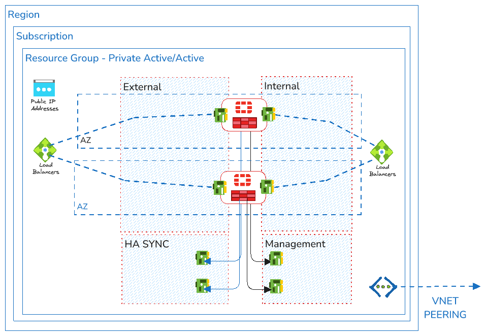

Here's a cleaned-up version of the markup:

# Deployment of a FortiGate-VM (BYOL/PAYG) ELB and ILB on Azure in different zones

## Introduction

This topology is only recommended for using with FOS 7.6.1 and later.



Network Port Configuration:
- port1: hamgmt
- port2: public/untrust
- port3: private/trust
- port4: hasync

A Terraform script to deploy a FortiGate-VM with ILB and ELB on Azure

## Requirements

- Terraform >= 1.10.0
- Terraform Provider AzureRM >= 4.16.0
- Terraform Provider Template >= 2.2.0
- Terraform Provider Random >= 3.6.3

## Deployment Overview

Terraform deploys the following components:
- Azure Virtual Network with 4 subnets
- Two FortiGate-VM (BYOL/PAYG) instances with four NICs, each in different zones
- Two firewall rules
- A Ubuntu Client instance

## Deployment Steps

1. Clone the repository
2. Customize variables in `terraform.tfvars.example` and `variables.tf`
   - Rename `terraform.tfvars.example` to `terraform.tfvars`

3. Initialize providers and modules:
   ```sh
   cd XXXXX
   terraform init
   ```

4. Submit Terraform plan:
   ```sh
   terraform plan
   ```

5. Verify output
6. Apply the plan:
   ```sh
   terraform apply
   ```
7. Confirm by typing `yes`

Output will include:
- Active FGT Management Public IP
- Passive FGT Management Public IP
- Password
- Resource Group
- Username

## Destroy the Instance

```sh
terraform destroy
```

## VM Image Terms Acceptance

### PAYG
```sh
az vm image terms accept \
    --publisher fortinet \
    --offer fortinet_fortigate-vm_v5 \
    --plan fortinet_fg-vm_payg_2023_g2
```

### BYOL
```sh
az vm image terms accept \
    --publisher fortinet \
    --offer fortinet_fortigate-vm_v5 \
    --plan fortinet_fg-vm
```

## Fabric Connector

The FortiGate-VM uses a Service Principal for the SDN Fabric Connector. A connector is created automatically during deployment.

### Creating Service Principal

```sh
az ad sp create-for-rbac \
    --name "fortigate-tf-demo" \
    --role contributor \
    --scopes /subscriptions/730184c8-d6fd-4fb1-8060-aeb6d67c7bc2 \
    --query "{client_id: appId, client_secret: password, tenant_id: tenant}" \
    -o json
```

## Support and License

- Support: GitHub [Issues](https://github.com/fortinet/fortigate-terraform-deploy/issues)
- Contact: [github@fortinet.com](mailto:github@fortinet.com)
- License: [GitHub License](https://github.com/fortinet/fortigate-terraform-deploy/blob/master/LICENSE)